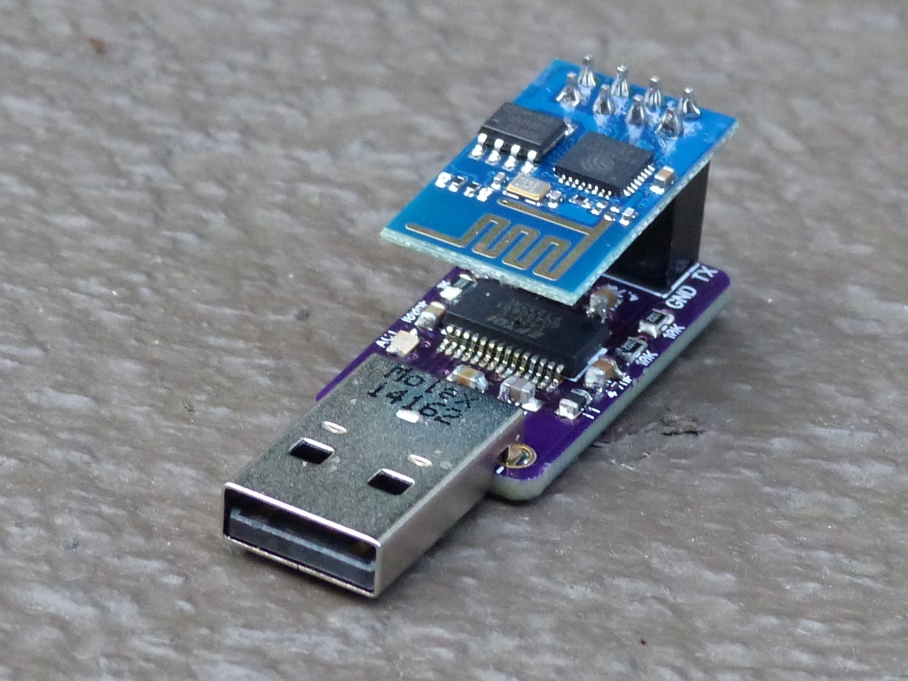

### EspPlug ###

This board is intended to allow direct interfacing between ESP8266 modules and
your computer via the USB serial port.

#### Serial parameters ####

Default module settings are `9600,N,8,1` for older firmware versions and
`115200,N,8,1` for newer.

#### Jumpers ####

JP1 and JP2 on the bottom of the board control GP0 pin of ESP8266 module. At
most one jumper should be soldered at any time. If connected to GND, ESP8266
module will enter firmware update mode every time it is plugged in. If GP0 is
connected to DTR#, firmware update can be programmatically controlled; i.e.
when DTR is high, firmware update will be enabled and when DTR is low, normal
operation will proceed. Both these jumpers can be left disconnected if firmware
upgrade functionality is not needed.

#### Commands ####

All commands have prefix AT and have to end with <CR><LF>.

##### AT #####

Replies with OK.

###### Example ######

    AT

    OK

##### ATE`state` #####

Turn character echoing off (`0`) or on (`1`).

Echo will be turned on by default and every time device is reset.

`state`:
  * `0` - Echo off
  * `1` - Echo on

###### Example ######

    ATE0

    OK

##### AT+RST #####

Reset the module.

###### Example ######

    AT+RST

    OK
    c_▒▒RS▒▒FjS▒fJ[▒▒▒
    [Vendor:www.ai-thinker.com Version:0.9.2.4]

    ready

##### AT+GMR #####

Shows the firmware version.

###### Example ######

    AT+GMR
    0018000902-AI03

    OK

##### AT+CIUPDATE #####

Upgrades the firmware from cloud. Must be connected as client to access point
with Internet access. Upgrade itself takes couple of minutes.

If firmware upgrade fails, at [Electrodragon Blog](http://blog.electrodragon.com/cloud-updating-your-wi07c-esp8266-now/)
you can see instructions for manual firmware update and a link to [binaries](https://drive.google.com/folderview?id=0B_ctPy0pJuW6d1FqM1lvSkJmNU0&usp=sharing)
needed for repair. To enter bootloader mode short between GP0 and GND will be
needed (exposed on board's bottom as jumper link). Alternative firmwares and
tools can be found on [Electrodragon Documentation](https://drive.google.com/folderview?id=0B3dUKfqzZnlwRXhBTmlhaTROTmM&usp=sharing)
page.

###### Example ######

    AT+CIUPDATE
    +CIPUPDATE:1
    +CIPUPDATE:2
    +CIPUPDATE:3
    +CIPUPDATE:4

    OK

     ets Jan  8 2013,rst cause:4, boot mode:(3,6)

    wdt reset
    load 0x40100000, len 212, room 16
    tail 4
    chksum 0x5e
    load 0x3ffe8000, len 788, room 4
    tail 0
    chksum 0x1c
    load 0x3ffe8314, len 72, room 8
    tail 0
    chksum 0x55
    csum 0x55
    jump to user1
    rN▒
    ready

##### AT+CIOBAUD=`rate` #####

Changes baud rate.

###### Example ######

    AT+CIOBAUD=115200
    BAUD->115200

    OK

##### AT+CIOBAUD? #####

Shows current baud rate.

Result is given as:
> +CIOBAUD:`rate`

###### Example ######

    AT+CIOBAUD?
    +CIOBAUD:9600

    OK

##### AT+CWMODE=`mode` #####

Changes the mode to one specified after the command.

`mode`:
  * `1` - Client
  * `2` - Access point
  * `3` - Both client and access point

###### Example ######

    AT+CWMODE=1

    OK

##### AT+CWMODE? #####

Read current mode.

Result is given as:
> +CWMODE:`mode`

`mode`:
  * `1` - Client
  * `2` - Access point
  * `3` - Both client and access point

###### Example ######

    AT+CWMODE?
    +CWMODE:1

    OK

##### AT+CWLAP #####

Shows visible networks. Only valid in client modes (`1` and `3`).

Results are given as multiple lines each formatted as:
> +CWLAP:(`security`,"`ssid`",`db`,"`mac`",`channel`)

`security`:
  * `0` - No authentication
  * `1` - No authentication
  * `2` - WEP
  * `3` - WPA
  * `4` - WPA2

###### Example ######

    AT+CWLAP
    +CWLAP:(3,"DIRECT-roku-374-F9AA61",-57,"40:a7:37:e0:32:a5",1)
    +CWLAP:(4,"HOME-38C0",-93,"f4:32:c8:d0:38:c0",1)
    +CWLAP:(0,"xfinitywifi",-90,"26:32:c8:d0:38:c2",1)
    +CWLAP:(1,"kaostation",-86,"c0:1d:19:de:23:21",1)
    +CWLAP:(4,"HOME-ACD0",-89,"a4:32:c8:cc:ac:d0",1)
    +CWLAP:(3,"Prashant",-91,"e0:e5:2a:aa:65:66",1)
    +CWLAP:(3,"Polaris",-47,"fc:ee:7b:30:a9:e8",1)
    +CWLAP:(3,"Gost",-48,"ec:ee:7b:30:a9:e9",1)
    +CWLAP:(0,"xfinitywifi",-90,"e6:32:c8:cc:ac:d2",1)
    +CWLAP:(3,"NETGEAR",-82,"a0:22:3f:9f:f2:2a",2)
    +CWLAP:(3,"kao",-88,"bc:22:0b:2f:e8:08",6)
    +CWLAP:(4,"kao3",-85,"bc:22:0b:2f:e8:09",6)
    +CWLAP:(3,"HOME-13C8",-94,"b0:26:f3:ab:13:c8",6)
    +CWLAP:(0,"xfinitywifi",-89,"b6:32:c8:25:16:dc",1)
    +CWLAP:(3,"NETGEAR21",-54,"64:94:fc:3f:6f:0c",11)
    +CWLAP:(4,"HOME-4982",-83,"60:1a:ca:22:49:80",11)
    +CWLAP:(4,"HOME-7A7F",-90,"3c:35:40:d2:7a:7f",1)
    +CWLAP:(4,"150104",-92,"ac:35:40:67:65:79",1)

    OK

##### AT+CWJAP #####

Join the network giving the SSID and password. Both should be enclosed in
quotes.

###### Example ######

    AT+CWJAP="Polaris","SomePassword"

    OK

##### AT+CWJAP? #####

Shows joined network.

Result is given as:
> +CWJAP:"`ssid`"

###### Example ######

    AT+CWJAP?
    +CWJAP:"Polaris"

    OK

##### AT+CWQAP #####

Disconnects client from network.

###### Example ######

    AT+CWQAP

    OK

##### AT+CWSAP="`ssid`","`password`",`channel`,`security` #####

Set access point parameters. Valid only in AP modes (`2` and `3`).

`channel` is between 1 and 13.

`security`:
  * `0` - No authentication
  * `1` - WEP
  * `3` - WPA
  * `4`  WPA2

###### Example ######

AT+CWSAP="Test","Password",1,0

##### AT+CWSAP? #####

Returns current access point parameters.

Result is given as:
> +CWSAP:"`ssid`","`password`",`channel`,`security`

###### Example ######

    AT+CWSAP?
    +CWSAP:"ESP_9CB4F7","",1,0

    OK

##### AT+CWLIF #####

Show access point clients.

Result is given as:
> `ip`,`mac`

###### Example ######

    AT+CWLIF
    192.168.4.100,ac:f8:ae:51:89:07

    OK

##### AT+CIFSR #####

Gives module IP address. First address given will be address in access point
mode (`2` or `3`) while second address will be one used in client mode (`1` or
`3`).

Results are given as list of:
> `ip`

###### Example ######

    AT+CIFSR
    192.168.4.1
    192.168.100.105

    OK

##### AT+CIFSR (newer) #####

Returns IP address assigned to module in following format:
> +CIFSR:STAIP,"`ip`"
> +CIFSR:STAMAC,"`mac`"

###### Example ######

    AT+CIFSR
    +CIFSR:STAIP,"192.168.200.126"
    +CIFSR:STAMAC,"18:fe:34:9c:a4:aa"

    OK

##### AT+CIPMUX=`multi` #####

Sets whether multiple connections are to be used.

`multi`:
  * `0` - Single connection only
  * `1` - Multiple connections enabled

###### Example ######

    AT+CIPMUX=1

    OK

##### AT+CIPMUX? #####

Returns whether multiple connections are supported.

Results are given as:
> +CIPMUX:`multi`

`multi`:
  * `0` - Single connection only
  * `1` - Multiple connections enabled

###### Example ######

    AT+CIPMUX?
    +CIPMUX:0

##### AT+CIPSTATUS #####

Returns the status of the connection.

Result for server connection is given as:
> STATUS:`status`

For client connection results are:
> +CIPSTATUS:`id`,`protocol`,"`ip`",`port`,`remoteport`,`status`

`status`:
  * `0` - Connected
  * `2` - Listening
  * `4` - Disconnected

###### Example ######

    AT+CIPSTATUS
    STATUS:4
    +CIPSTATUS:0,"UDP","192.168.1.119",514,13566,0
    +CIPSTATUS:2,"UDP","192.168.1.111",514,18867,0

    OK

##### AT+CIPSTART="`protocol`",`ip`,`port` #####

Starts TCP or UDP connection in single connection mode.

`protocol`:
  * `UDP` - User Datagram Protocol
  * `TCP` - Transmission Control Protocol

###### Example (UDP) ######

    AT+CIPSTART="UDP","192.168.1.119",514
    0,CONNECT

    OK

###### Example (TCP) ######

    AT+CIPSTART="TCP","192.168.1.119",80
    0,CONNECT

    OK

    
##### AT+CIPSTART=`id`,"`protocol`",`ip`,`port` #####

Starts TCP or UDP connection in multiplexed mode.

`protocol`:
  * `UDP` - User Datagram Protocol
  * `TCP` - Transmission Control Protocol

###### Example ######

    AT+CIPSTART=0,"UDP","192.168.1.119",514
    0,CONNECT

    OK

##### AT+CIPSEND=`count` #####

Sends number of characters over the connection.

Given characters can be inputed only after prompt (`>`) and command
automatically completes as soon as enough characters are received.

##### Example #####

    AT+CIPSEND=26
    > ABCDEFGHIJKLMNOPQRSTUVWXYZ
    SEND OK

    
##### AT+CIPSEND=`id`,`count` #####

Sends number of characters over the multiplexed connection.

Given characters can be inputed only after prompt (`>`) and command
automatically completes as soon as enough characters are received.

##### Example #####

    AT+CIPSEND=1,26
    > ABCDEFGHIJKLMNOPQRSTUVWXYZ
    SEND OK

##### AT+CIPCLOSE #####

Closes the connection.

###### Example ######

    AT+CIPCLOSE
    CLOSED

    OK

    
##### AT+CIPCLOSE=`id` #####

Closes the connection in multiplexed mode.

###### Example ######

    AT+CIPCLOSE=3
    3,CLOSED

    OK

##### AT+CIPSERVER=`1`,`port` #####

Starts TCP server on a given port. Multiplex mode must be turned on.

###### Example ######

    AT+CIPSERVER=1,514

    OK

##### AT+CIPSERVER=`0` #####

Closes TCP server connection. Module reset is needed after it.

###### Example ######

    AT+CIPSERVER=0
    we must restart

##### AT+CIPSTO=`timeout` #####

Sets server's connection timeout value. Value can only be set while server is
listening.

###### Example ######

    AT+CIPSTO=120

    OK

##### AT+CIPSTO? #####

Returns currently set server timeout value.

Format is as follows:
> +CIPSTO:`timeout`

###### Example ######

    AT+CIPSTO?
    +CIPSTO:180

    OK

##### `id`,`state` #####

This is an unsolicited output that gets received every time there is a change
on server connection.

`state`
  * `CONNECT` - Connection established
  * `CLOSED` - Connection closed

###### Example ######

    0,CONNECT

##### +IPD #####

This is an unsolicited output that gets received every time server receives
data.

Format:
> +IPD,`id`,`count`:`data`

###### Example ######

    +IPD,0,26:ABCDEFGHIJKLMNOPQRSTUVWXYZ
    OK

    
#### Schematics ####

#### Manufacturing ####

If you want to make this board your self, just grab the latest gerbers and send
them over to [OSH Park](http://oshpark.com/) (or any other PCB manufacturer of
your choice).

---

*You can check my blog and other projects at [www.jmedved.com](http://www.jmedved.com/).*
